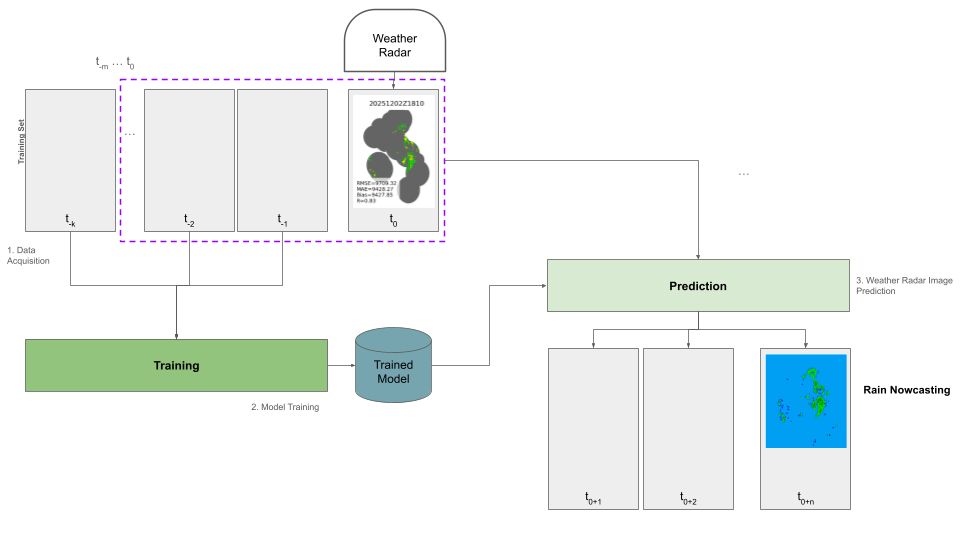
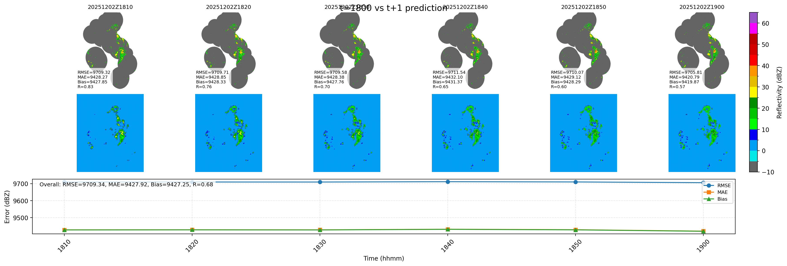

# RainPredictor – Hybrid Training + Inference (GeoTIFF, Full Resolution)

This repository focuses on radar nowcasting and aligns with how the Italian Civil Protection Department’s Radar Platform presents national-scale meteorological information, namely through real-time processing of raw data from the national radar network, along with rain and temperature station networks, satellite observations, and lightning network data [link](https://mappe.protezionecivile.gov.it/en/risks-maps-and-dashboards/radar-map/). 



This project implements a radar nowcasting model that:

- Trains on GeoTIFF radar images at native resolution (no resize).
- Uses zero-padding (bottom/right) to satisfy UNet + Transformer patch constraints.
- Preserves georeferencing (CRS + affine transform) when saving predictions.
- Provides:
  - `train.py` for training,
  - `predict.py` for m→n inference,
  - `utils/compare.py` for quick visual comparison in lon/lat.

## Documentation

- [Training guide](docs/train.md) — end-to-end training workflow and experiment notes.
- [Inference guide](docs/predict.md) — minimal inference-only usage.
- [Comparison tool](docs/compare.md) — visualize truth vs. predictions and compute metrics (`utils/compare.py`).
- [Dataset downloader](docs/download_dataset.md) — fetch radar GeoTIFF sequences from a base URL (`utils/download_dataset.py`).
- [Dataset splitter](docs/make_splits.md) — create train/val/test splits for GeoTIFF datasets (`utils/make_splits.py`).
- [Radar metadata inspector](docs/radar_info.md) — inspect VMI GeoTIFF values and stats (`utils/radar_info.py`).
- [Radar viewer](docs/radar_viewer.md) — visualize radar TIFF/GeoTIFF files with LUTs (`utils/radar_viewer.py`).
- [Sequence selector](docs/select_sequences.md) — scan datasets and select GeoTIFF sequences (`utils/select_sequences.py`).

## 1. Example Radar-style Naming

Example input frames:

```text
rdr0_d01_20251202Z1510_VMI.tiff
rdr0_d01_20251202Z1520_VMI.tiff
...
rdr0_d01_20251202Z1800_VMI.tiff
```

If you run:

```bash
python predict.py \
  --checkpoint checkpoints/best_model.pth \
  --input-dir /data/radar_seq \
  --output-dir /data/preds \
  --m 18 \
  --n 6
```

The code:

- Infers the time step from the last two inputs (e.g., 10 minutes).
- Builds the next `n` timestamps.
- Produces future filenames:

```text
rdr0_d01_20251202Z1810_VMI.tiff
rdr0_d01_20251202Z1820_VMI.tiff
...
```

All outputs are full-resolution GeoTIFFs with CRS and transform identical to the inputs.

## 2. Training Example

Dataset layout:

```text
/data/rdr0_splits/
├─ train/
│  ├─ rdr0_d01_*.tiff
├─ val/
│  ├─ rdr0_d01_*.tiff
```

Train with:

```bash
python train.py \
  --data-path /data/rdr0_splits \
  --epochs 20 \
  --batch-size 4 \
  --lr 1e-3 \
  --num-workers 8 \
  --pred-length 6
```

Use `--small-debug` to run a tiny subset for quick testing.

TensorBoard:

```bash
tensorboard --logdir runs
```

## 3. Inference Example

After training, run inference on a sequence directory:

```bash
python predict.py \
  --checkpoint checkpoints/best_model.pth \
  --input-dir /data/radar_seq \
  --output-dir /data/preds \
  --m 18 \
  --n 6
```

Options:

- `--pattern .tif` (default) or `.tiff` depending on files.
- `--cpu` to force CPU inference.
- `--resample-factor` to resample input frames in-place before inference (e.g., `0.5` halves resolution).

## 4. Visual Comparison in Physical Coordinates

```bash
python utils/compare.py \
  --input /data/radar_seq/rdr0_d01_20251202Z1800_VMI.tiff \
  --pred  /data/preds/rdr0_d01_20251202Z1810_VMI.tiff \
  --title "t=1800 vs t+1 prediction"
```

This script:

- Uses rasterio to get transform and extent.
- Plots input and predicted frames side-by-side in lon/lat.
- Adds colorbars for quick qualitative assessment.



## 5. Reproducibility Notes

- `set_seed(15)` is called in the data and training code.
- Hyperparameters can be controlled from:
  - `rainpred/config.py` (defaults),
  - CLI flags in `train.py` and `predict.py`.
- All GeoTIFF outputs keep the original CRS and transform so that they can be
  consumed by GIS software or downstream hydrological models directly.


## 6. Multi-GPU and restartable training (summary)

- `train.py` automatically uses all visible GPUs via `torch.nn.DataParallel` when `DEVICE` is `cuda` and more than one GPU is available.
- Use `--resume-from /path/to/last_checkpoint.pth` to restart from an intermediate checkpoint.
- Control how often `last_checkpoint.pth` is refreshed with `--save-every N`.
- `predict.py` can load checkpoints produced on single-GPU or multi-GPU runs; if parameters were saved with a `module.` prefix, this is handled automatically.
